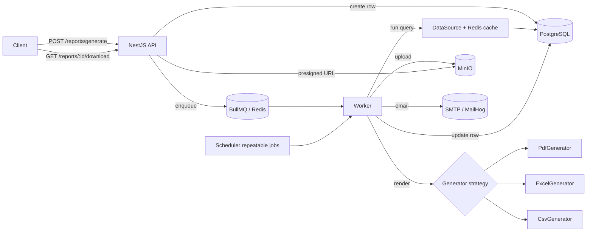
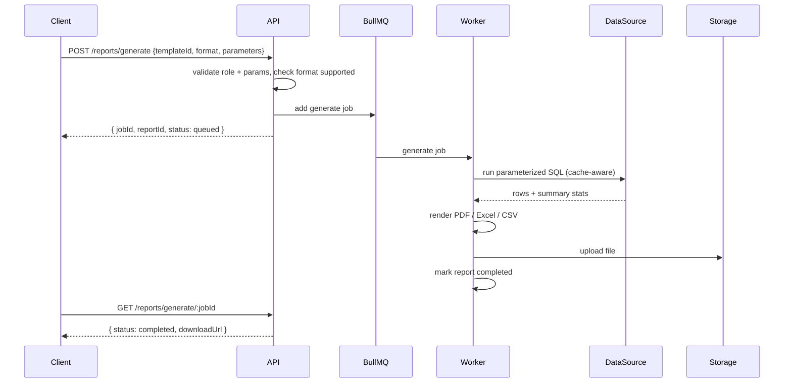

# report-api-nodejs

A dynamic **report generation API**. Admins define templates (a parameterized SQL query + a layout); users request reports in **PDF, Excel, or CSV**; generation runs asynchronously on a queue, files land in object storage, and results are cached, scheduled, and emailed.

Built with **NestJS 10 · TypeScript 5 · Prisma (PostgreSQL) · Redis · BullMQ · PDFKit · ExcelJS · Chart.js · Nodemailer · MinIO**.

---

## Table of contents

- [Architecture](#architecture)
- [Generation pipeline](#generation-pipeline)
- [Quick start](#quick-start)
- [Configuration](#configuration)
- [Authentication model](#authentication-model)
- [Template configuration guide](#template-configuration-guide)
- [Scheduling](#scheduling)
- [Sample reports](#sample-reports)
- [API reference](#api-reference)
- [Testing](#testing)
- [Project layout](#project-layout)

---

## Architecture



The generators follow a **strategy pattern** — `BaseGenerator` → `PdfGenerator` / `ExcelGenerator` / `CsvGenerator`, selected by `GeneratorService`. Adding a format means adding one class and registering it.

## Generation pipeline



## Quick start

```bash
# 1. Bring up postgres, redis, minio, mailhog, api, worker
docker compose up --build

# — or run locally —
cp .env.example .env
npm install
npm run prisma:generate
npm run prisma:migrate      # or: npm run db:push
npm run prisma:seed         # seeds a demo `orders` table + "Sales by Status" template
npm run start:dev           # API
npm run worker:dev          # worker (separate terminal)
```

- API: `http://localhost:3000/api/v1`
- Swagger: `http://localhost:3000/docs`
- MinIO console: `http://localhost:9001` (minioadmin / minioadmin)
- MailHog inbox: `http://localhost:8025`

Generate your first report (the seed prints a template id; `list templates` also shows it):

```bash
TPL=$(curl -s localhost:3000/api/v1/templates -H 'x-user-id: u1' -H 'x-user-roles: admin' | jq -r '.[0].id')

JOB=$(curl -s -X POST localhost:3000/api/v1/reports/generate \
  -H 'content-type: application/json' -H 'x-user-id: u1' -H 'x-user-roles: analyst' \
  -d "{\"templateId\":\"$TPL\",\"format\":\"pdf\",\"parameters\":{\"date_from\":\"2026-01-01\",\"date_to\":\"2026-12-31\",\"status\":\"all\"}}" \
  | jq -r '.jobId')

curl -s "localhost:3000/api/v1/reports/generate/$JOB" -H 'x-user-id: u1' -H 'x-user-roles: analyst' | jq
```

## Configuration

All config is environment-driven (see `.env.example`). Highlights:

| Variable | Purpose | Default |
|---|---|---|
| `DATABASE_URL` | Primary PostgreSQL | — |
| `ANALYTICS_DATABASE_URL` | Optional secondary connection (`dataSource: "analytics"`) | falls back to primary |
| `REDIS_HOST` / `REDIS_PORT` | Cache + queue | localhost:6379 |
| `CACHE_DEFAULT_TTL` | Query cache TTL (s) | 300 |
| `DASHBOARD_CACHE_TTL` | Dashboard cache TTL (s) | 60 |
| `MINIO_*` | Object storage + presign expiry | localhost:9000 |
| `SMTP_*` / `MAIL_FROM` | Email delivery | MailHog |
| `MAIL_ATTACH_MAX_BYTES` | Attach vs link threshold | 10 MB |
| `DEFAULT_RETENTION_DAYS` | Report expiry | 90 |
| `CLEANUP_CRON` | Daily cleanup schedule | `0 3 * * *` |

## Authentication model

This reference API trusts an upstream gateway and reads identity from headers, so it drops cleanly behind your own auth:

- `x-user-id` — the caller's id (report ownership)
- `x-user-roles` — comma-separated roles, e.g. `admin,analyst`

Authorization is enforced by `RolesGuard` (route roles) and per-resource ownership checks (users download only their own reports; `admin` sees all). Swap `AuthGuard` for a JWT strategy without touching the modules.

## Template configuration guide

A template is defined once by an admin. Example body for `POST /templates`:

```jsonc
{
  "name": "Sales by Status",
  "description": "Orders in a date range, grouped by status.",
  "dataQuery": "SELECT customer, status, amount, created_at FROM orders WHERE created_at BETWEEN $1 AND $2 AND ($3 = 'all' OR status = $3) ORDER BY created_at DESC",
  "dataSource": "primary",
  "parametersSchema": {
    "date_from": { "type": "date", "required": true },
    "date_to":   { "type": "date", "required": true },
    "status":    { "type": "string", "default": "all", "enum": ["all","completed","pending","cancelled","refunded"] }
  },
  "supportedFormats": ["pdf", "xlsx", "csv"],
  "layoutConfig": {
    "title": "Sales by Status",
    "subtitle": "Order revenue breakdown",
    "orientation": "portrait",
    "columns": [
      { "field": "customer",   "header": "Customer", "width": 160, "format": "string" },
      { "field": "status",     "header": "Status",   "width": 100, "format": "string" },
      { "field": "amount",     "header": "Amount",   "width": 100, "format": "currency" },
      { "field": "created_at", "header": "Date",     "width": 120, "format": "date" }
    ],
    "summary": [
      { "field": "amount", "op": "sum",   "label": "Total Revenue", "format": "currency" },
      { "field": "amount", "op": "avg",   "label": "Avg Order",     "format": "currency" },
      { "field": "amount", "op": "count", "label": "Orders",        "format": "number" }
    ],
    "groupBy": "status",
    "sortBy": { "field": "created_at", "direction": "desc" },
    "chart": { "type": "bar", "labelField": "status", "dataField": "amount", "aggregate": "sum", "title": "Revenue by Status" }
  },
  "accessRoles": ["admin", "analyst"],
  "cacheTtlSeconds": 300,
  "retentionDays": 90
}
```

**SQL safety.** Placeholders `$1..$n` bind to the parameters schema keys **in declared order** and are passed to Postgres as bound parameters via `$queryRawUnsafe(sql, ...values)` — user input is **never** string-interpolated into SQL. `column format` values: `string · number · currency · percent · date`.

Preview a template against sample parameters with `GET /templates/:id/preview`.

## Scheduling

```jsonc
// POST /schedules
{
  "templateId": "…",
  "format": "xlsx",
  "parameters": { "date_from": "2026-01-01", "date_to": "2026-01-31", "status": "all" },
  "cronExpression": "0 8 * * 1",             // every Monday 08:00
  "recipients": ["ops@acme.com", "cfo@acme.com"]
}
```

Each active schedule becomes a **BullMQ repeatable job**. On trigger the worker generates the report, stores it, and emails recipients — **attaching** the file when it's under `MAIL_ATTACH_MAX_BYTES`, otherwise sending a **presigned download link**. `last_run_at` / `next_run_at` are tracked on the row.

Cron examples: `0 8 * * 1` (Mon 8am) · `0 6 1 * *` (1st of month 6am) · `*/15 * * * *` (every 15 min).

## Sample reports

- **PDF** — cover page (company name/logo, title, date-range parameters, generated-by, timestamp); a **Summary** page with metric cards (Total Revenue, Avg Order, Orders); an embedded **bar chart** (Revenue by Status); then a paginated **data table** with a blue header repeated on every page, alternating row shading, right-aligned currency, and a `Page X of Y` footer with timestamp. Portrait or landscape.
- **Excel** — a styled **Summary** sheet with named ranges (`Metric_Total_Revenue`, …) and a **Data** sheet: typed columns (currency/number/date formats), frozen header, auto-filter, a color-scale on numeric columns, and a `SUM()` **total row**.
- **CSV** — UTF-8 BOM (opens clean in Excel), configurable delimiter, RFC-4180 escaping, summary rows appended below the data.

## API reference

Base path: `/api/v1`. All requests carry `x-user-id` and `x-user-roles`.

### Reports
| Method | Path | Notes |
|---|---|---|
| POST | `/reports/generate` | Enqueue generation → `{ jobId, reportId }` |
| GET | `/reports/generate/:jobId` | Status → `queued \| processing \| completed \| failed` (+ `downloadUrl`) |
| GET | `/reports` | List (filters: `templateId,format,generatedBy,from,to,page,pageSize`) |
| GET | `/reports/:id/download` | Presigned download URL (owner or admin) |
| DELETE | `/reports/:id` | Delete report + stored file |

### Templates
| Method | Path | Role |
|---|---|---|
| POST | `/templates` | admin |
| GET | `/templates` | any (filtered to accessible) |
| GET | `/templates/:id` | any |
| PUT | `/templates/:id` | admin |
| DELETE | `/templates/:id` | admin |
| GET | `/templates/:id/preview` | any with access |

### Schedules
| Method | Path | Role |
|---|---|---|
| POST | `/schedules` | admin, analyst |
| GET | `/schedules` | any |
| PUT | `/schedules/:id` | admin, analyst |
| DELETE | `/schedules/:id` | admin, analyst |

### Dashboard
| Method | Path | Notes |
|---|---|---|
| GET | `/dashboard/:templateId` | Raw JSON (rows + summary + chart series), short-cached |

## Testing

```bash
npm test           # unit tests (generators, validator, binder, summary)
npm run test:cov   # with coverage
```

Unit tests verify: PDF starts with `%PDF-` and is non-trivial; Excel has Summary + Data sheets and a formula total row; CSV has a BOM and escapes delimiters; parameter validation (defaults, coercion, enums, required); SQL binding order; summary math.

## Project layout

```
src/
  common/           prisma, redis, storage(minio), mail, auth, filters, types, validation
  config/           env-driven typed configuration
  queue/            queue + job name constants
  modules/
    templates/      CRUD + preview
    reports/        orchestration (enqueue, status, list, download) + processor + sql-binder
    generators/     base + pdf + excel + csv + chart/format utils + factory
    data-sources/   parameterized query execution + Redis caching + summary stats
    schedules/      cron scheduling (repeatable jobs) + email delivery
    dashboard/      JSON data endpoint
    maintenance/    daily cleanup of expired reports
prisma/             schema + seed
docker/             Dockerfile (canvas libs + fonts)
report-templates/   handlebars email template
```
